<!-- github.com/roothex200 -->

<!-- PROJECT LOGO -->
 

## **Auction App**
  

     Auction is another practice app.  I have learn more things from this project
     
    

  
      

    <a href="https://github.com/RootHex200/Auction-App/issues">Report Bug</a>
    ·
    <a href="https://github.com/RootHex200/Auction-App/issues">Request Feature</a>
  

## About The Project

  
Table of Contents

  <ol>
    <li>
      <a href="#about-the-project">About The Project</a>
      <ul>
        <li><a href="#features-with-snapshots">Features with Snapshots</a></li>
        <li><a href="#built-with">Built With</a></li>
      </ul>
    <li><a href="#roadmap">Roadmap</a></li>
   
  </ol>

<!-- ABOUT THE PROJECT -->
## About The Project

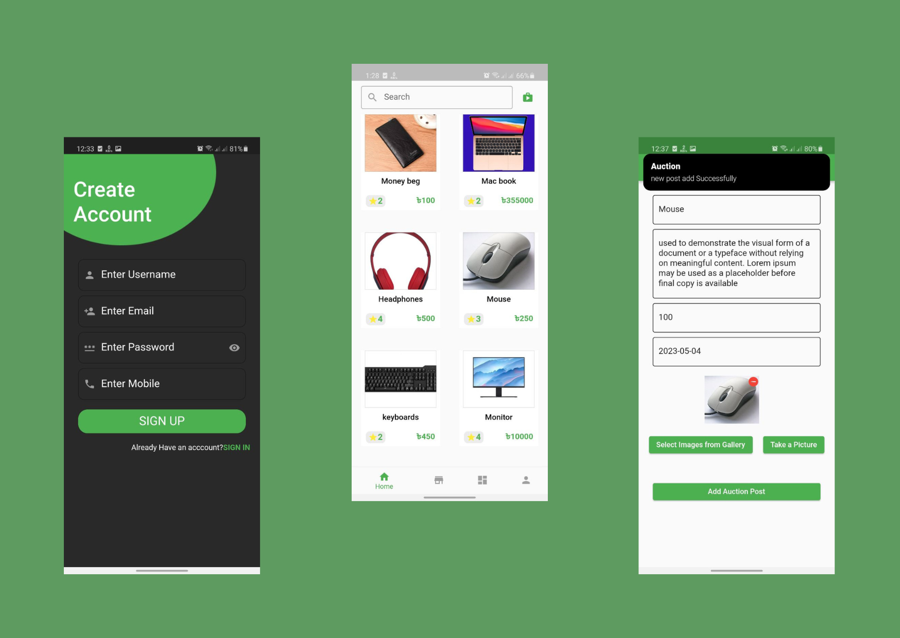

 
Auction is android app version.In this app user can add new auction post and see all bid list and update bid list in specific date of post.and check dashboard of summary of product.The app was made with Flutter as a Frontend technology and Firebase as a backend
 
 
* APK Link: https://drive.google.com/file/d/10P2IgMyglC76n2URLKnZA0UPdb-bXxmg/view?usp=share_link

(<a href="#top">back to top</a>)

## Features with Snapshots
1. User Login and Registers.
   

snapshot

   
     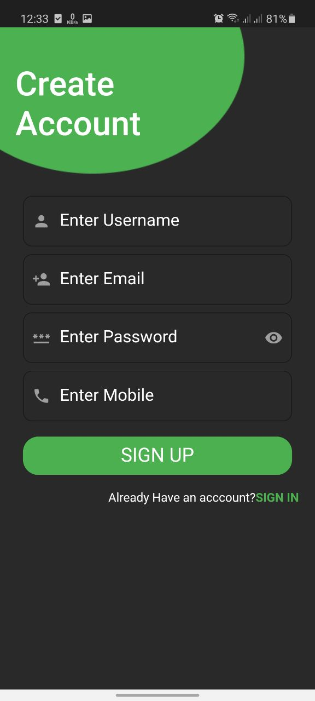

   

2. Home page
   

snapshot

    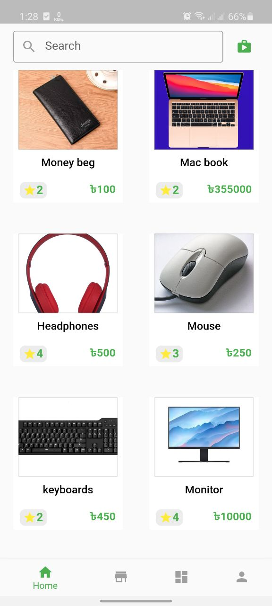 
   

3. Details Page
   

snapshot

   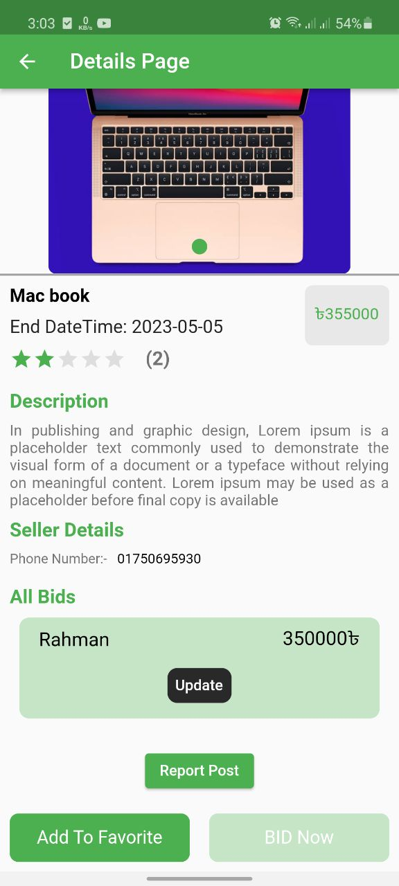

   

3. Mypost item
   

snapshot

   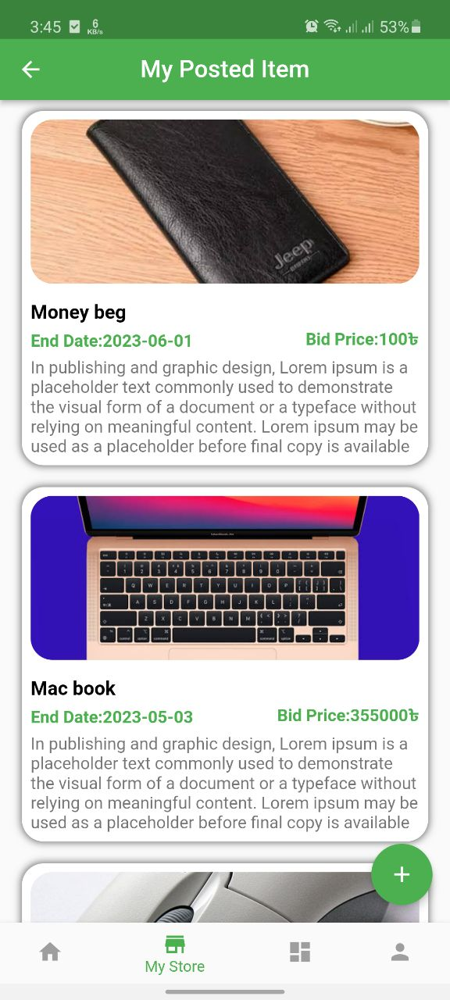

   

5. Add item
   

snapshot

   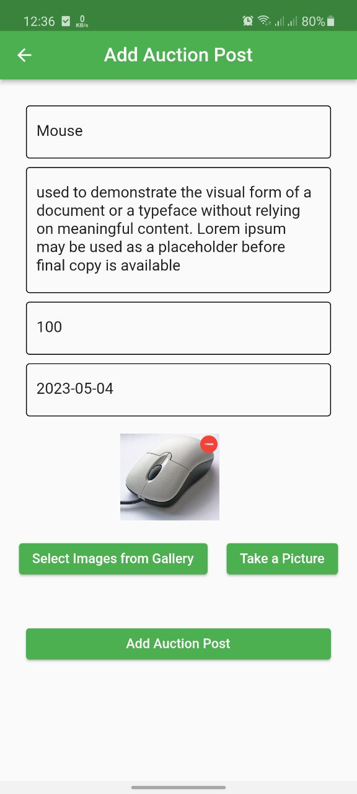 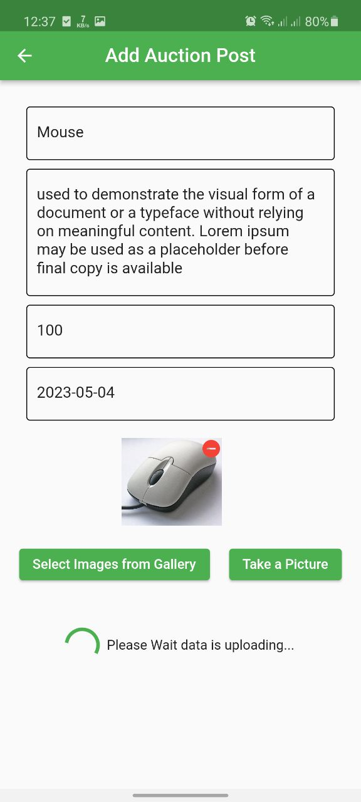 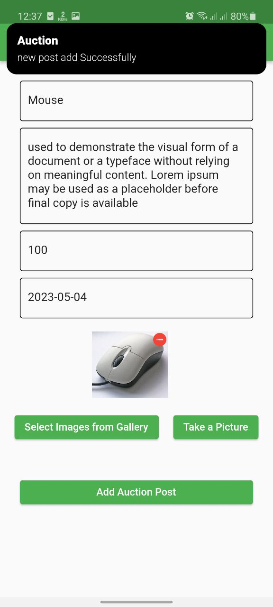

   

4. If current user is win any bid then show 1st image. if other user win show 2nd image
   

snapshot

   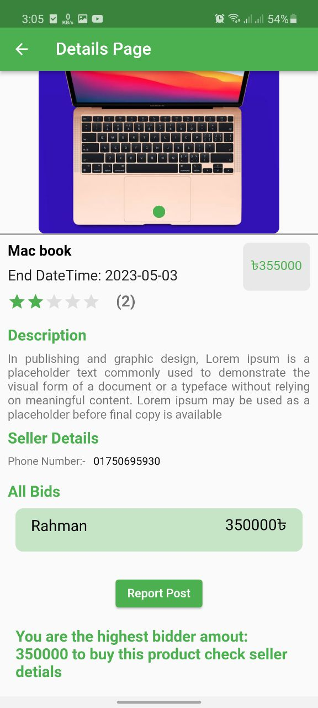 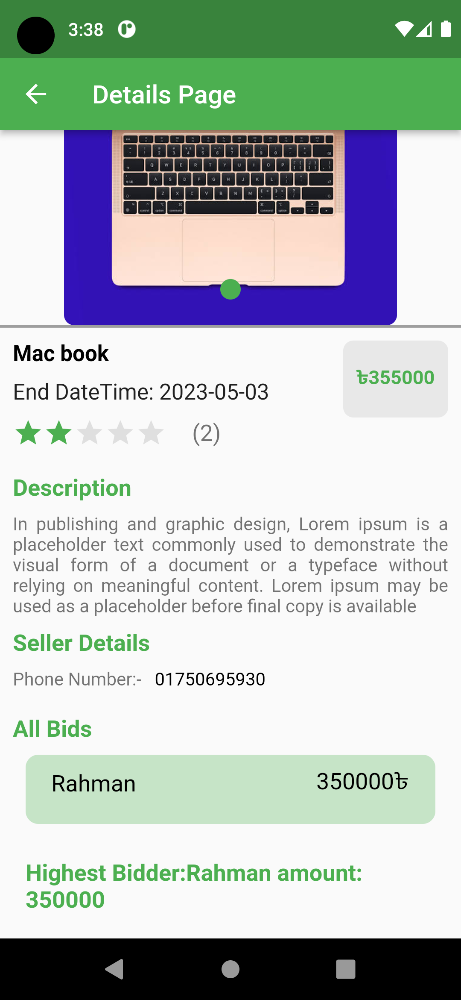
   

4. Report Option and Post owner cant't perform report. 2nd image other user and 3rd image post ownner
   

snapshot

   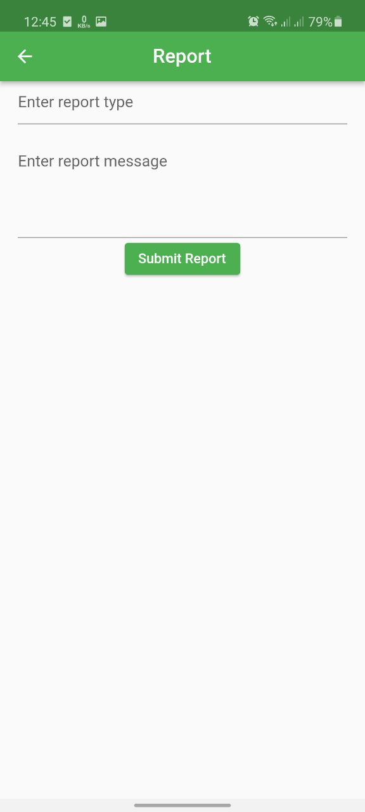 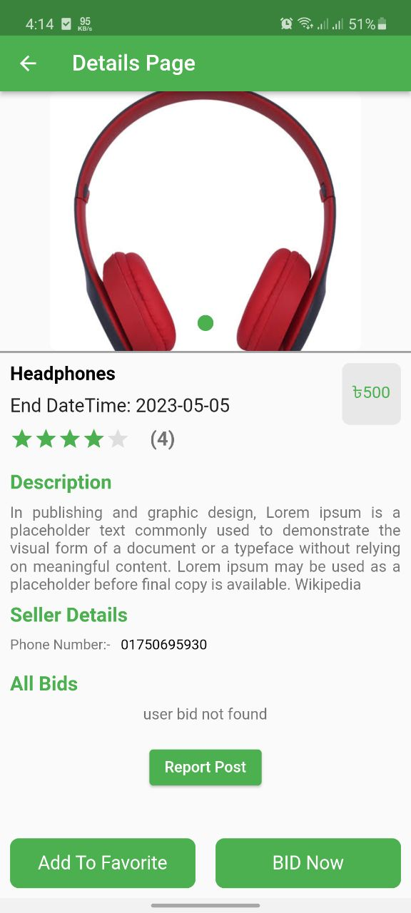 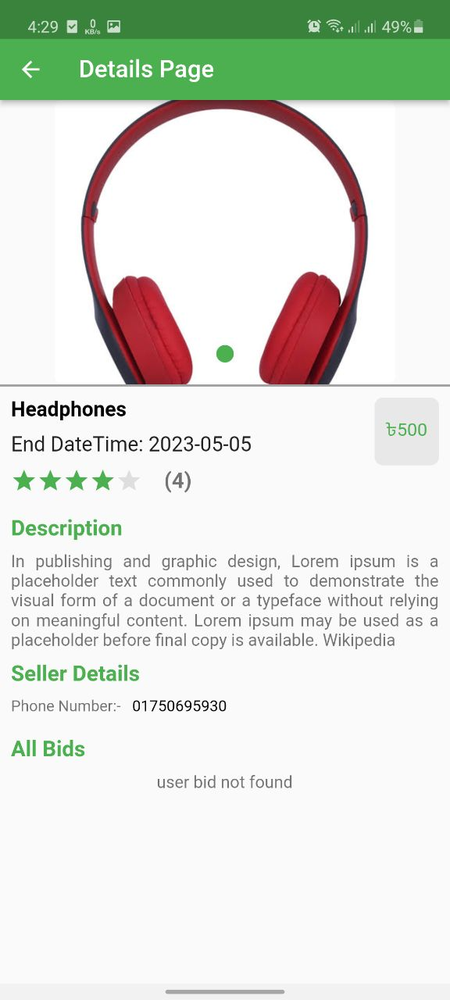
   

4. Post owner cant't perform favourite option and bid option
   

snapshot

   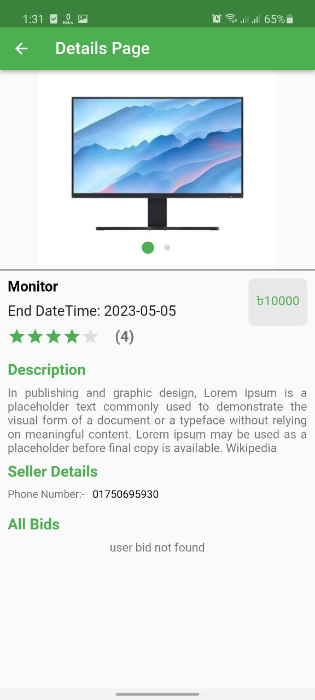
   

3. Favourite Page
   

snapshot

   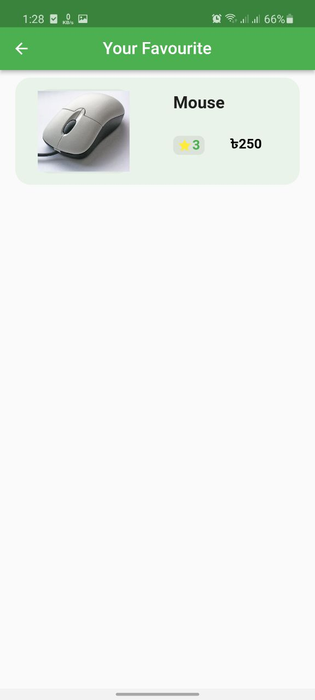

   

4. User profile
   

snapshot

   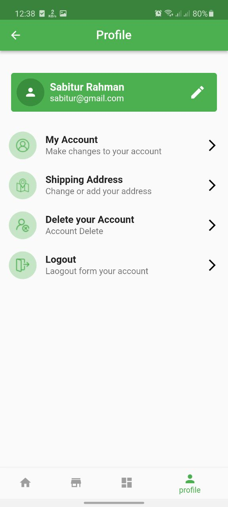 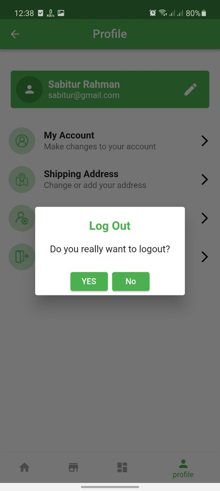 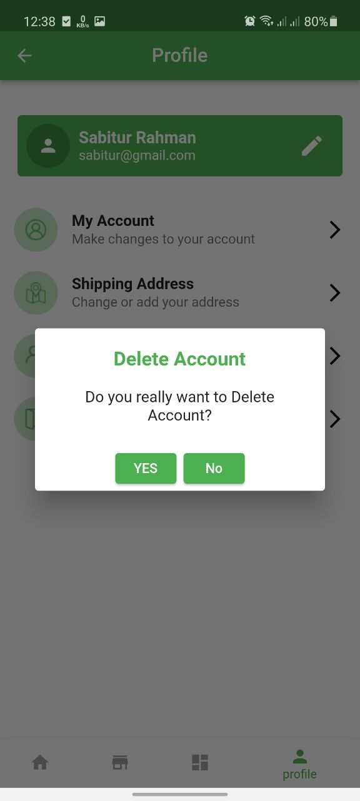
   

5. Get chart view from running bid ,completed bid ,i have 10 item in firebase that's why time series line is simple but when you added more item then it is will be more beautiful
   

snapshot

    

   

## Built With 
#### Frontend Technology  
* [Flutter](https://flutter.dev/?gclsrc=ds&gclsrc=ds)  
Features and Plugins I've used: 
   - Firebase
   - Getx
   - image_picker
   - charts_flutter_new

  

(<a href="#top">back to top</a>)

## Prerequisites

######
* **Flutter**

  Flutter has a greate [documentation](https://docs.flutter.dev/get-started/install) for enviroment setup 

## Roadmap
#### Frontend
- [x] Login and Register screen was a simple with firebase
- [x] after login when you click in floatingActionButton then you see simple from that is input from you to post item . in this case i use from and image_picker to pick image from camera and gallery and  datetime picker to get datetime for endtime of bid .. that's why i use those
- [x] home page
   when you add new post then you show this post in you gallery tab with other user post.
    to make this function i use getx with rxdart to get all item as a reactive approach.but i use user.email for unique identifier because firebase not allow to registration as a duplicated email that why i use but i know this harmful for database security this is my bad and sorry for that.. and i create a current user check function to get current user.email for unique identifier
        
- [x] myposteditem
   in this section just show you post when you add new post.. you can see how many post you.
    this is like same just filter user.email and you get just your post item

- [x] details page
    when you click item and you go to details page.you can see product image,price , description ,all bids, and add bit button for make new bid . and if timeend for this item then you can see winner of bids.. and you can add new bid and update this bids to make this function 

- [x] i check in ui that if (currentDateTime.isAfter(enddate) ||enddate == currentDateTime) {"can't make bid time is gone"} otherwise you can make new bid

- [x] i face simple problem for update bid price in firebase that is "i can't update map item of list" after thinking i make simple solution that fist remove previous item and add new item
-->for remove
"users.doc(bitListUpdatedModel.auctionid).update({
      "bidlist": FieldValue.arrayRemove([
        {"useremail": currentUserEmail, "bidprice": bitListUpdatedModel.previousbidprice}
      ])
    });"
-->for add 
"    users.doc(auctionid).update({
      "bidlist": FieldValue.arrayUnion([
        {"useremail": currentUserEmail, "bidprice": bidprice}
      ])
    });
"
then i see my updated bid price .. this my solution..

- [x] and when your item date gone you show in details page who is winner to make this function.this is easy this is max numner find algorithm 

    

(<a href="#top">back to top</a>)

